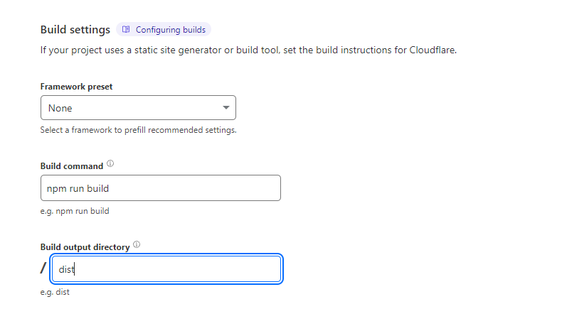

# git setup
1. Created Github repository for project "Honeyflow"
2. Created Folder for prooject on local computer "Honeyflow"
3. Created devlog.md and updated steps
4. Link the local folder to github repo
5. Command line is Ctrl + ~
```
git init
git add devlog.md
git commit -m "first commit"
git branch -M main
git remote add origin https://github.com/BrendonVince/Honeyflow.git
git push -u origin main
```
6. Tried to run git init but not recognized, find way to install git
7. path was not recognized, installed git via website but then path was not recognized when running git init.
8. Resetting computer resolved issue, git init now works.
9. Ran `git commit -m "first commit"` encountered "Author identity unknown"
10. Set Global Identity in git 
```
git config --global user.email "your.email@example.com"
git config --global user.name "Your Name"
```
11. Re- execute `git commit -m "first commit"`  Success
12. Completing git setup, ensuring compatability

# setup nodejs
1. download and install node https://nodejs.org/en (don't install random choccy shit), be conventional
2. Install vit by `$ npm create vite@latest` 
```
√ Project name: ... Honeyflow
√ Package name: ... honeyflow
√ Select a framework: » React
√ Select a variant: » TypeScript + SWC
```
3. npm created new folder called Honeyflow but we moved contents one layer above and deleted empty folder 
 Next time setup vite first before setting up repo 
4. Run these commands
```
npm install
npm run dev
```
5. npm has installed packages, local website running.

# publishing website
1. commit current changes
```
git add .
git commit -m "vite starter template"
git push 
```
2. setup cloudflare pages
 

3. Website is deployed at https://honeyflow.pages.dev (Not accessible in chrome for me but checked in firefox and external computer, cache issue)

# write website functionality
1. conceptually articulate website functionality
one pager with conditional background colour, text, update time & honey emojji
2. shift+alt+f = auto formatting
3. decide on data input structure: update data in an array, so we can display latest of array
data: array of [status, time]
4. lets not dynamically update for now, and make sure refresh page to see latest status
5. need `momentjs` to display and parse time, by running `npm add moment`
6. ctrl+shift+p opens up vscode command prompt, type reload window to reload
7. once reloaded, vscode has recognised momnentjs as a library and can now autocomplete for us
8. ctrl+shift+o to auto organise imports
9. now we have text and update time displayed

10. got emoji by copying from messenger, styled emoji with css, it's now complete

